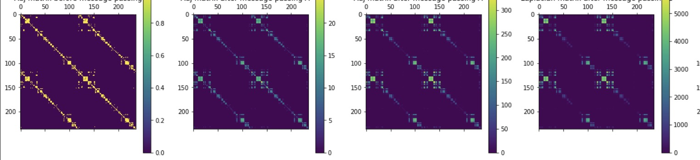

# GitModel (Graph Intelligence Tensor)



GitModel is a pipeline that can generate high quality topic models of github repos using GPT, GNN
message passing layers and BERTopic.

- Generate documentation for Python repos and create enriched subgraphs for your
  codebases
- Swap system prompt tasks(bug hunting, todo, documentation labeling, etc) for
  enriching semantic graph and dataset building.
  - The generated data is saved to context folder.
  - in src/format_system_prompts. w/ tree works but it requires manual changing
    one line of code. will fix soon
- Pre-commit for isort, prettier, detect private_keys, black, flake8, and more.
- GNN Message Passing and Topic modeling pipeline as an inductive bias (GRNN)
- BERTopic is highly customizable and can compose several different clustering,
  embedding, vectorizers, bag of words and dimensionality reduction techniques.


Contributions Welcome! This is a great guide for how to make a pull request

- https://github.com/huggingface/diffusers/blob/main/CONTRIBUTING.md

## How to Use

```bash
python3.10 -m venv venv && source venv/bin/activate && pip install -U pip setuptools wheel
pip install -r requirements.txt
python __main__.py
```

**main.py**

```python
import argparse
from getpass import getpass

import openai

from src import Pipeline

if __name__ == "__main__":
    argsparse = argparse.ArgumentParser()
    argsparse.add_argument("--config", type=str, default="./test_config.yaml")
    argsparse.add_argument("--repo", type=str, default="https://github.com/danielpatrickhug/GitModel.git")
    argsparse.add_argument("--repo_name", type=str, default="gitmodel")

    args = argsparse.parse_args()

    openai_secret = getpass("Enter the secret key: ")
    # Set up OpenAI API credentials
    openai.api_key = openai_secret

    print("starting pipeline")
    pipeline = Pipeline.from_yaml(args.config)
    gnn_head_outputs, topic_model_outputs = pipeline.run(args.repo, args.repo_name)
    for i, topic_model_output in enumerate(topic_model_outputs):
        topic_model_output["data"].to_csv(f"context/{args.repo_name}_topic_model_outputs_{i}.csv")
        topic_model_output["topic_info"].to_csv(f"context/{args.repo_name}_topic_info_{i}.csv")
        with open(f"context/{args.repo_name}_tree_{i}.txt", "w", encoding="utf-8") as f:
            f.write(topic_model_output["tree"])
```
## Topic model your dependencies.

If you have enough patience or a lot of money to afford more then one computer.
run GitModel on /venv/lib/python3.10/site-packages


## Examples

### Gitmodel

- https://github.com/danielpatrickhug/GitModel
- uses Deepminds clrs topic tree in system prompt during semantic graph
  generation

```

. ├─Function description and comparison including Gaussian kernel and sparse
matrices\_**\_ │ ├─■──Understanding the Purpose and Handling of a Function for
Sparse Matrices with Inputs, Outputs, and P ── Topic: 9 │ └─Understanding
kernels and functions in the 'kernels.py' file for estimating PDF and computing
simila │ ├─■──Purpose and functions of kernel-related functions in kernels.py
file of a Python program, including ── Topic: 22 │ └─■──Understanding the
cos_sim and cos_sim_torch functions in kernels.py file\_\_** ── Topic: 25
└─Graph message passing and adjacency matrix computation using embeddings\_**\_
├─k-hop message passing and cosine similarity kernel computation for graph
embeddings\_\_** │ ├─k-hop message passing with adjacency matrix and node
features\_**\_ │ │ ├─Computation of Gaussian Kernel Matrix between Two Sets of
Embeddings using PyTorch\_\_** │ │ │ ├─■──Cosine Similarity with PyTorch Tensors
and Functional.\_**_ ── Topic: 1 │ │ │ └─■──Function to compute adjacency matrix
for embeddings using specified kernel type and threshold value_ ── Topic: 19 │ │
└─Message Passing and K-hop Aggregation in Graphs using Sparse Matrices and Node
Features\_\_** │ │ ├─■──Document pruning and adjacency matrix recomputation
using embeddings and thresholding\_**\_ ── Topic: 11 │ │ └─k-hop message passing
and adjacency matrix computation in sparse graphs.\_\_** │ │ ├─■──Computing
graph laplacian and degree matrix from pairwise distances using a given
function.\_**\_ ── Topic: 7 │ │ └─■──Message Passing with K-hop Adjacency and
Aggregated Features in Sparse Matrices\_\_** ── Topic: 8 │ └─"Outlier Reduction
Using Count-TF-IDF and OpenAI Representation Model"\_**\_ │ ├─Topic Modeling and
Outlier Reduction in Natural Language Processing (NLP)\_\_** │ │ ├─Understanding
the compose\*inference function in a chatbot system.\_**\_ │ │ │ ├─■──Processing
conversation transcripts with Python functions\_\_** ── Topic: 18 │ │ │
└─Understanding the compose_inference function in a chatbot conversation with
message templates\_\*\*\* │ │ │ ├─■──Understanding the `compose_inference`
Function in Chatbot Conversation Generation with OpenAI GPT\_** ── Topic: 2 │ │
│ └─■──Function to create prompt message template with role and text input
parameters and validation of rol ── Topic: 17 │ │ └─Outlier Reduction with
Machine Learning Models\_**\_ │ │ ├─Document processing and reduction techniques
for topic modeling with various machine learning models │ │ │ ├─MiniLM language
model for sentence embedding\_\_** │ │ │ │ ├─■──Embedding sentences using MiniLM
language model with multiprocessing and GPU acceleration\_**\_ ── Topic: 15 │ │
│ │ └─■──Embedding Sentences using Pre-Trained Language Model with
SentenceTransformer Library\_\_** ── Topic: 23 │ │ │ └─■──Topic modeling
algorithms and document reduction techniques\_**\_ ── Topic: 0 │ │ └─SQLalchemy
migrations in online mode with engine configuration\_\_** │ │ ├─■──Probability
Density Estimation with Gaussian Kernel Density Estimator\_**\_ ── Topic: 12 │ │
└─Running database migrations with SQLAlchemy and Alembic\_\_** │ │ ├─■──Graph
network message passing & Mobile App Navigation System Design\_**\_ ── Topic: 21
│ │ └─■──Running migrations with SQLAlchemy and Alembic in online mode\_\_** ──
Topic: 6 │ └─Class Settings definition using BaseSettings and its purpose for
managing configuration in a third-p │ ├─■──Empty class definition for managing
application settings using Pydantic's BaseSettings\_**\_ ── Topic: 3 │
└─■──MemoryTreeManager class implementation\_\_** ── Topic: 16 └─Codebase
decomposition and analysis with Git repository and AST nodes.\_**\_ ├─Code
decomposition and processing in Git repositories.\_\_** │ ├─■──Python code
parsing and analysis\_**\_ ── Topic: 4 │ └─Code decomposition in a Git
repository\_\_** │ ├─■──Decomposing Git Repositories with System Prompts.\_**\_
── Topic: 10 │ └─Parsing and pruning files in a GitHub repository\_\_** │
├─■──parsing and pruning files in a local Git repository\_**\_ ── Topic: 5 │
└─■──purpose of `get_repo_contents` function in `repo_graph_generation.py` for
retrieving and pruning Git ── Topic: 24 └─Analyzing chatbot main capabilities in
a codebase using natural language processing and notable fram ├─■──summarizing
code in a GitHub repository using ChatGPT\_\_** ── Topic: 14 └─Understanding
Codebase Structure and Functionality with Hierarchical Trees and
Frameworks\_**\_ ├─■──Analyzing codebase structure and functionalities using a
hierarchical topic tree\_\_\*\* ── Topic: 13 └─■──Understanding the difference
between format_system_prompts and format_system_prompts_with_tree in a ── Topic:
20

```

w/ graph code bert embeddings

```

. ├─"The Pipeline Class and Its Methods in GitModel Project"\_**\_ │
├─Probability Density Estimation using Gaussian KDE in SciPy\_\_** │ │
├─Probability density function estimation using Gaussian kernel density
estimation\_**\_ │ │ │ ├─■──Probability density estimation with Gaussian
kernel\_\_** ── Topic: 16 │ │ │ └─■──Understanding cos\*sim_torch function and
configuring context with URL and target metadata\_**\_ ── Topic: 14 │ │ └─Empty
class definition for MessageTreeManagerConfiguration in Python\_\_** │ │ ├─Empty
class definition in MessageTreeManagerConfiguration with BaseModel
inheritance.\_**\_ │ │ │ ├─■──Questions about bug fixing with system prompts in
kernel computation with tensors and matrices.\_\_** ── Topic: 13 │ │ │ └─Empty
class definitions and inability to determine expected behavior of
MemoryTreeManager class\_**\_ │ │ │ ├─■──Purpose of run_migrations_online in
Alembic environment file\_\_** ── Topic: 12 │ │ │ └─■──Empty class definition of
MessageTreeManagerConfiguration inheriting from BaseModel\_\*\*\* ── Topic: 25 │
│ └─Understanding the purpose of SemanticGraphContextGenerator and TopicModel
classes in the codebase\_** │ │ ├─■──Purpose of Pipeline class in codebase with
SemanticGraphContextGenerator, MessageTreeManagerConfigur ── Topic: 15 │ │
└─■──Understanding the purpose and usage of TopicModel class in dimensional
tensors and input shape setti ── Topic: 20 │ └─GitModel Pipeline class with
find_files_with_substring method\_**\_ │ ├─GitModel Pipeline Class and
find_files_with_substring Method Description\_\_** │ │ ├─■──Understanding the
`clone_and_create_context_folder` Function\_**\_ ── Topic: 4 │ │ └─GitModel
Pipeline class and methods for searching files with substring\_\_** │ │
├─GitModel Pipeline class and methods for file searching\_**\_ │ │ │ ├─■──Python
class for loading and initializing configuration values from a YAML file with
dynamic imports ── Topic: 9 │ │ │ └─■──The Pipeline class and its methods in
GitModel project configuration and file searching.\_\_** ── Topic: 10 │ │
└─■──Python Pipeline Class for Generating a Semantic Graph Context for Git
Repository Data Processing\_**\_ ── Topic: 8 │ └─■──Cloning and Storing
Repository in "Work" Folder with Custom Name using Python Function\_\_** ──
Topic: 22 └─Understanding the purpose and input of a Pipeline class in a project
involving semantic graphs and e ├─Topic Modeling with Hierarchical Topics and
Outlier Reduction Strategies in Python\_**\_ │ ├─Working with context folders
and creating directories using os module.\_\_** │ │ ├─■──Creating a work folder
and cloning a repository to create a context folder in Python\_**\_ ── Topic: 18
│ │ └─■──Working with context and folder paths in Python\_\_** ── Topic: 3 │
└─■──Topic modeling and representation using hierarchical and ctfidf
models\_**\_ ── Topic: 5 └─PyTorch function for computing Gaussian kernel matrix
and k-hop message passing on an adjacency matr ├─Compute k-hop adjacency matrix
and aggregated features using message passing in graph analysis.\_\_** │ ├─k-hop
message passing with adjacency matrix and node features\_**\_ │ │ ├─■──Document
Pruning and Adjacency Matrix Recomputation\_\_** ── Topic: 23 │ │ └─Computing
k-hop adjacency matrix with message passing in graph neural networks.\_**\_ │ │
├─■──Computing k-hop adjacency matrix and aggregated features using message
passing\_\_** ── Topic: 0 │ │ └─■──GNNHead class for computing kernel matrix
with node features in numpy array\_**\_ ── Topic: 1 │ └─Data Migrations in
Offline Mode.\_\_** │ ├─■──Degree matrix computation using adjacency distance
matrix and pairwise distances in Python\_**\_ ── Topic: 21 │ └─■──SQLAlchemy
migration in 'offline' mode\_\_** ── Topic: 11 └─Understanding code inputs and
purpose in a Pipeline class\_**\_ ├─Parsing Python files using AST module and
extracting specific information\_\_** │ ├─■──Cosine Similarity Computation using
PyTorch and NumPy\_**\_ ── Topic: 6 │ └─■──Python code parsing and data
extraction using AST\_\_** ── Topic: 17 └─Code Structure and Purpose of Pipeline
Class with Config and Semantic Graph Context Generator in Pyt ├─Code for a
Pipeline with Semantic Graph Context Generator\_**\_ │ ├─■──Understanding
Pipeline Class and Semantic Graph Context Generation in Python Code\_\_** ──
Topic: 24 │ └─■──Summarizing code in a GitHub repository using ChatGPT\_**\_ ──
Topic: 2 └─Semantic Graph Context Generator Class and Methods\_\_**
├─■──Semantic Graph Context Generation for Git Repositories.\_**\_ ── Topic: 19
└─■──Implementation of class instantiation using configuration and dictionary
mapping.\_\_\*\* ── Topic: 7

```

### DeepMind CLRS

- https://github.com/deepmind/clrs

```

. ├─Purpose and Attributes of the `Net` Class in Graph Neural Networks\_**\_ │
├─Graph Attention Networks and DAG Shortest Paths in JAX.\_\_** │ │ ├─Graph
Attention Networks (GAT and GATv2) code implementation\_**\_ │ │ │ ├─Code for
DAG shortest path and depth-first search algorithms\_\_** │ │ │ │ ├─■──String
Matching and Maximum Subarray\_**\_ ── Topic: 10 │ │ │ │ └─Depth-First Search
and DAG Shortest Path Algorithms implemented in Python\_\_** │ │ │ │
├─■──Description of string probe functions in probing.py file for Hash Table
probing.\_**\_ ── Topic: 1 │ │ │ │ └─Graph Algorithms - DFS and DAG Shortest
Paths\_\_** │ │ │ │ ├─■──Graph algorithms (DFS and DAG shortest path) in
Python\_**\_ ── Topic: 0 │ │ │ │ └─■──Functions for decoding diff and graph
features in PyTorch graph neural networks.\_\_** ── Topic: 6 │ │ │ └─■──Graph
Attention Networks (GAT and GATv2)\_**\_ ── Topic: 20 │ │ └─■──Message Passing
with \_MessagePassingScanState, \_MessagePassingOutputChunked and
MessagePassingStateC ── Topic: 17 │ └─Implementing a Baseline Model with
Selectable Message Passing Algorithm and its Dataset Sampler.\_\_** │ ├─Handling
of untrained parameters in optimization updates\_**\_ │ │ ├─■──Updating
parameters with filtered gradients from multiple algorithms.\_\_** ── Topic: 8 │
│ └─■──Processing trajectory hints with variable-length time dimension using
batching.\_**\_ ── Topic: 9 │ └─Processing time-chunked data with batched
samplers and message passing nets.\_\_** │ ├─Model processing of time-chunked
data with dataset sampling and batch processing\_**\_ │ │ ├─■──CLRS dataset
download and URL retrieval on Google Cloud Platform\_\_** ── Topic: 13 │ │
└─Chunked data and dataset sampling with JAX.\_**\_ │ │ ├─■──JAX functions for
reshaping and restacking data for pmap computation\_\_** ── Topic: 4 │ │ └─Data
chunking with batched sampling and message passing in neural networks.\_**\_ │ │
├─Processing time-chunked data with batch samplers and a NetChunked class\_\_**
│ │ │ ├─■──Time-chunked data processing using BaselineModelChunked and
NetChunked in TensorFlow.\_**\_ ── Topic: 2 │ │ │ └─■──Creating samplers for
training data.\_\_** ── Topic: 11 │ │ └─■──Documented code for sampling
algorithms using randomized position generation.\_**\_ ── Topic: 3 │ └─■──Point
Sampling and Convex Hull Computation\_\_** ── Topic: 18 └─Loss functions for
training with time-chunked data\_**\_ ├─Loss calculation for time-chunked and
full-sample training.\_\_** │ ├─Code functions for evaluating predictions using
permutations and masking\_**\_ │ │ ├─■──Functions for Evaluating Predictions in
Probing Tasks.\_\_** ── Topic: 7 │ │ └─■──permutation pointer manipulation and
reduction in predictions\_**\_ ── Topic: 16 │ └─Loss calculation and decoder
output postprocessing in neural networks.\_\_** │ ├─■──Postprocessing with
Sinkhorn operator in log space\_**\_ ── Topic: 15 │ └─■──Loss calculation
methods for training with time and full samples\_\_** ── Topic: 19 └─Functions
for expanding and broadcasting JAX arrays\_**\_ ├─Description and input/output
parameters of \_expand_to and \_is_not_done_broadcast functions\_\_** │
├─■──Array expansion and broadcasting techniques\_**\_ ── Topic: 21 │
└─■──Purpose and Functionality of \_is_not_done_broadcast Function\_\_** ──
Topic: 14 └─Sampler classes and associated data generation types\_**\_
├─■──Understanding Parameters and Expected Input/Output of Various Functions
(including mst_prim, floyd_w ── Topic: 5 └─■──Sampling classes and their data
generation purpose\_\_** ── Topic: 12

```

- recurrent generation augmented with the above topic tree in system prompt

```

. ├─DFS and DAG Shortest Paths Algorithm Implementation with Probing\_**\_ │
├─■──Bipartite matching-based flow networks\_\_** ── Topic: 34 │ └─Search and
Shortest Path Algorithms\_**\_ │ ├─DAG shortest path algorithm with probing and
initialization\_\_** │ │ ├─■──Strongly Connected Components Algorithm with
Kosaraju's Implementation\_**\_ ── Topic: 37 │ │ └─Graph Sampling and DAG
Shortest Path Algorithm\_\_** │ │ ├─■──Bipartite matching using Edmonds-Karp
algorithm\_**\_ ── Topic: 18 │ │ └─■──Random graph generation using Bellman-Ford
algorithm in Python\_\_** ── Topic: 0 │ └─Graham scan convex hull algorithm
implementation in Python\_**\_ │ ├─■──Maximum subarray algorithm
implementation\_\_** ── Topic: 6 │ └─■──Graham scan convex hull algorithm
implementation\_**\_ ── Topic: 12 └─Postprocessing Decoder Output for Chunked
Data Processing Net\_\_** ├─Postprocessing Decoder Output with Chunked Data in
JAX\_**\_ │ ├─Functions and Files in Probing.py Explained\_\_** │ │ ├─Functions
and techniques for data splitting and replication in probing and pmap
computation.\_**\_ │ │ │ ├─Understanding the strings_pair_cat function and
split_stages function in probing.py file\_\_** │ │ │ │ ├─TFDS CLRSDataset
Command-Line Tool for Sampling Datasets\_**\_ │ │ │ │ │ ├─■──CLRS30 dataset and
related functions explanation\_\_** ── Topic: 5 │ │ │ │ │ └─■──TFDS CLRSDataset
Builder Implementation\_**\_ ── Topic: 16 │ │ │ │ └─Functions and Probing in
Python Code\_\_** │ │ │ │ ├─Purpose of the `split_stages` function in
`probing.py` and related functions for evaluating
`ProbesD │ │ │ │ │ ├─Functions for evaluating hint and output predictions using permutation objects and dictionaries.____ │ │ │ │ │ │ ├─Processing randomized `pos`input in a sampler with pointers and permutations.____ │ │ │ │ │ │ │ ├─■──Process randomization of`pos`input in algorithms including string algorithms____ ── Topic: 29 │ │ │ │ │ │ │ └─■──A function to replace should-be permutations with proper permutation pointers using a sample iterato ── Topic: 19 │ │ │ │ │ │ └─Function for Evaluating Permutation Predictions using Hint Data____ │ │ │ │ │ │ ├─■──Function to Reduce Permutations in a Dictionary of Result Objects____ ── Topic: 11 │ │ │ │ │ │ └─■──Function to evaluate hint predictions with tuple and list inputs____ ── Topic: 17 │ │ │ │ │ └─Understanding probing functions in Hash Table implementation____ │ │ │ │ │ ├─Hash Table Probing Functions in probing.py File____ │ │ │ │ │ │ ├─■──Splitting ProbesDict into DataPoints by stage in Python____ ── Topic: 14 │ │ │ │ │ │ └─■──Understanding Hash Table Probing Functions (strings_pi, strings_pos, strings_pair_cat) in Python's`
── Topic: 1 │ │ │ │ │ └─■──Functions for Checking Input Dimensions in Machine
Learning Models\_**_ ── Topic: 15 │ │ │ │ └─JAX pmap reshaping and computation
functions (\_pmap_reshape, \_maybe_pmap_reshape, \_maybe_pmap_data)_ │ │ │ │
├─JAX pmap computation and pytree reshaping\_\_** │ │ │ │ │ ├─■──Purpose and
attributes of the Stage and OutputClass classes\_**\_ ── Topic: 22 │ │ │ │ │
└─■──JAX tree reshaping for pmap computation with \_pmap_reshape and
\_maybe_pmap_reshape functions\_\_** ── Topic: 3 │ │ │ │ └─Numpy array copying
functions with assertions\_**\_ │ │ │ │ ├─■──Functions for copying data between
numpy arrays in Python\_\_** ── Topic: 21 │ │ │ │ └─■──Function Purpose and
Parameters Analysis in Codebase\_**\_ ── Topic: 9 │ │ │ └─Trajectory Batching
with Variable-Length Time Dimension\_\_** │ │ │ ├─■──Trajectory Batching and
Concatenation\_**\_ ── Topic: 35 │ │ │ └─■──Batch processing of variable-length
hint trajectories.\_\_** ── Topic: 31 │ │ └─Understanding the
`_is_not_done_broadcast` function and its input/output parameters.\_**\_ │ │
├─■──Understanding the \_is_not_done_broadcast function in JAX array for
sequence completion.\_\_** ── Topic: 8 │ │ └─■──Array broadcasting and expansion
with \_expand_and_broadcast_to and \_expand_to functions\_**\_ ── Topic: 27 │
└─Postprocessing Decoder Output with Sinkhorn Algorithm and Hard
Categorization\_\_** │ ├─Node Feature Decoding with Encoders and Decoders\_**\_
│ │ ├─■──Position Encoding Function for Natural Language Processing\_\_** ──
Topic: 23 │ │ └─Node feature decoding using decoders and edge features\_**\_ │ │
├─■──Creating Encoders with Xavier Initialization and Truncated Normal
Distribution for Encoding Categori ── Topic: 33 │ │ └─Node feature decoding with
decoders and edge features\_\_** │ │ ├─■──Node feature decoding and encoding
with decoders and edge features\_**\_ ── Topic: 2 │ │ └─■──Graph diff
decoders\_\_** ── Topic: 32 │ └─Postprocessing of decoder output in graph neural
networks.\_**\_ │ ├─Decoder Output Postprocessing with Sinkhorn Algorithm and
Cross-Entropy Loss\_\_** │ │ ├─Message Passing Net with Time-Chunked Data
Processing\_**\_ │ │ │ ├─■──Python Class for Message Passing Model with
Selectable Algorithm\_\_** ── Topic: 26 │ │ │ └─■──NetChunked message passing
operation with LSTM states for time-chunked data\_**\_ ── Topic: 7 │ │ └─Loss
calculation for time-chunked training with scalar truth data.\_\_** │ │ ├─Loss
calculation function for time-chunked training with scalar truth data.\_**\_ │ │
│ ├─■──Loss calculation for time-chunked training data\_\_** ── Topic: 4 │ │ │
└─■──Logarithmic Sinkhorn Operator for Permutation Pointer Logits\_**\_ ──
Topic: 10 │ │ └─■──Decoder postprocessing with Sinkhorn operator\_\_** ── Topic:
28 │ └─Gradient Filtering for Optimizer Updates\_**\_ │ ├─■──Filtering processor
parameters in Haiku models\_\_** ── Topic: 30 │ └─■──Filtering null gradients
for untrained parameters during optimization.\_**\_ ── Topic: 24 └─PGN with Jax
implementation and NeurIPS 2020 paper\_\_** ├─Message-Passing Neural Network
(MPNN) for Graph Convolutional Networks (GCNs)\_**\_ │ ├─■──"Applying Triplet
Message Passing with HK Transforms in MPNN for Graph Neural Networks"\_\_** ──
Topic: 20 │ └─■──Implementation of Deep Sets (Zaheer et al., NeurIPS 2017) using
adjacency matrices and memory networ ── Topic: 13 └─GATv2 Graph Attention
Network with adjustable sizes of multi-head attention and residual connections
├─■──Graph Attention Network v2 architecture with adjustable head number and
output size.\_**\_ ── Topic: 36 └─■──Processor factory with various models and
configurations\_\_** ── Topic: 25

```

## Langchain

- https://github.com/hwchase17/langchain

```

. ├─Combining documents with different chain types and LLM chains\_**\_ │
├─MapReduce Chain Loading and Combining\_\_** │ │ ├─Question answering chain
with sources loading and combining\_**\_ │ │ │ ├─■──Loading question answering
with sources chain with multiple loader mappings and chains.\_\_** ── Topic: 53
│ │ │ └─■──Loading and Combining Documents with Language Models for Summarizing
and QA\_**\_ ── Topic: 71 │ │ └─Map Reduce Chain Loading Function\_\_** │ │
├─Document Refinement using LLM Chains\_**\_ │ │ │ ├─■──Combining Documents with
Stuffing and LLM Chain in Python\_\_** ── Topic: 97 │ │ │
└─BaseQAWithSourcesChain document handling and processing.\_**\_ │ │ │
├─■──Question Answering with Sources over Documents Chain\_\_** ── Topic: 60 │ │
│ └─■──Python class for chatbot with vector database and question
generation\_**\_ ── Topic: 16 │ │ └─MapReduce chain implementation\_\_** │ │
├─■──MapReduceDocumentsChain document combination with chaining and
mapping\_**\_ ── Topic: 12 │ │ └─■──MapReduce Chain Loading Function\_\_** ──
Topic: 95 │ └─LLMBashChain document examples and related keywords\_**\_ │ ├─Bash
operations and language modeling chain implementation\_\_** │ │
├─LLMSummarizationCheckerChain document samples\_**\_ │ │ │ ├─■──Working with
SQL databases in Python using SQLDatabaseChain\_\_** ── Topic: 46 │ │ │
└─Document processing with LLMSummarizationCheckerChain\_**\_ │ │ │
├─■──Implementation of Program-Aided Language Models with PALChain class and
related prompts and assertio ── Topic: 31 │ │ │
└─■──LLMSummarizationCheckerChain class and its functionality\_\_** ── Topic: 93
│ │ └─LLMBashChain - interpreting prompts and executing bash code\_**\_ │ │
├─■──LLMMathChain - Python code execution for math prompts\_\_** ── Topic: 92 │
│ └─■──Bash execution with LLMBashChain\_**\_ ── Topic: 80 │ └─■──MRKLChain
implementation with ChainConfig and API integration\_\_** ── Topic: 59 └─Code
organization and structure in Python including several classes related to
self-hosted embedding ├─Code organization and improvement suggestions for a
class definition.\_**\_ │ ├─Code Loading and Organization Best Practices\_\_** │
│ ├─Web scraping Hacker News webpage titles\_**\_ │ │ │ ├─Loading files using
unstructured in Python\_\_** │ │ │ │ ├─Unstructured file loading with retry and
partitioning capabilities.\_**\_ │ │ │ │ │ ├─■──Retry Decorator for OpenAI API
Calls\_\_** ── Topic: 45 │ │ │ │ │ └─Unstructured File Loading and
Partitioning\_**\_ │ │ │ │ │ ├─■──Unstructured File Loader for Partitioning
Files in Various Formats\_\_** ── Topic: 25 │ │ │ │ │ └─■──Loading files with
Unstructured package in different modes (Python code).\_**\_ ── Topic: 26 │ │ │
│ └─PDF manipulation in Python with pypdf, pdfminer, fitz and pymupdf
libraries\_\_** │ │ │ │ ├─■──PDF file loading and text extraction using PyMuPDF
and PDFMiner\_**\_ ── Topic: 69 │ │ │ │ └─■──Extracting Text from Paged PDF
using PyPDF and PDFMiner\_\_** ── Topic: 96 │ │ │ └─Extracting Hacker News
Webpage Information using WebBaseLoader and BeautifulSoup.\_**\_ │ │ │ ├─■──Web
scraping Hacker News with BeautifulSoup and WebBaseLoader\_\_** ── Topic: 21 │ │
│ └─■──Web Scraping for College Confidential and Lyrics Websites\_**\_ ── Topic:
76 │ │ └─Code organization and structure in various Python modules\_\_** │ │
├─Compliments on clear and structured codebase with good use of type hints for
memory handling and con │ │ │ ├─Implementation of ReAct paper using ReActChain
with examples in Python\_**\_ │ │ │ │ ├─■──Implementation of ReAct paper in
ReActChain agent with OpenAI LLC model and tools\_\_** ── Topic: 101 │ │ │ │
└─In-memory Docstore for Efficient Lookup and Exploration\_**\_ │ │ │ │
├─■──Document Store Exploration with DocstoreExplorer\_\_** ── Topic: 87 │ │ │ │
└─■──InMemoryDocstore for Storing and Searching Documents with
AddableMixin\_**\_ ── Topic: 61 │ │ │ └─Compliments on Code Readability and
Organization in Python Codebase.\_\_** │ │ │ ├─Memory Handling and Conversation
Management\_**\_ │ │ │ │ ├─Memory Conversation Summarizer Implementation\_\_** │
│ │ │ │ ├─Memory and Conversation Summarization in AI-assisted dialogues.\_**\_
│ │ │ │ │ │ ├─■──Purpose of ChatPromptValue class in chat.py\_\_** ── Topic: 30
│ │ │ │ │ │ └─■──Memory management and conversation summarization in AI chatbot
system.\_**\_ ── Topic: 6 │ │ │ │ │ └─■──Implementation of Chain class with
CallbackManager and Memory attributes.\_\_** ── Topic: 52 │ │ │ │ └─Potential
bugs and suggestions for loading LLM, few-shot prompts, and examples from JSON
and YAML fi │ │ │ │ ├─Code structure and organization tips for loading examples
and templates from files in Python.\_**\_ │ │ │ │ │ ├─Compliments on code
structure and organization\_\_** │ │ │ │ │ │ ├─■──Loading few-shot prompts from
config with prefix and suffix templates\_**\_ ── Topic: 34 │ │ │ │ │ │ └─Code
organization and structure for creating chat prompt templates\_\_** │ │ │ │ │ │
├─■──Chat prompt template and message prompt templates for generating chatbot
prompts.\_**\_ ── Topic: 8 │ │ │ │ │ │ └─■──Purpose of `_load_prompt_from_file`
function in loading.py module.\_\_** ── Topic: 13 │ │ │ │ │ └─■──Function for
Loading a Chain of LLM Checkers from a Configuration Dictionary.\_**\_ ── Topic:
3 │ │ │ │ └─Documented class definitions for tools used in handling API
requests, including OpenSearchVectorSear │ │ │ │ ├─Handling API requests using
tools such as RequestsPostTool and OpenSearchVectorSearch\_\_** │ │ │ │ │
├─Python requests wrapper for making HTTP requests with various tools and
methods\_**\_ │ │ │ │ │ │ ├─■──DeepInfra API token and text generation model
wrapper\_\_** ── Topic: 41 │ │ │ │ │ │ └─RequestsWrapper and BaseRequestsTool
for making HTTP requests (POST, GET, PATCH, DELETE) to API endp │ │ │ │ │ │
├─■──Checking Validity of Template Strings with Input Variables and Formatter
Mapping\_**\_ ── Topic: 14 │ │ │ │ │ │ └─■──Requests tools for making HTTP
requests with Python\_\_** ── Topic: 10 │ │ │ │ │ └─Code organization and
positive feedback\_**\_ │ │ │ │ │ ├─Bing Search API Wrapper and Handler
Classes\_\_** │ │ │ │ │ │ ├─■──Langchain callback manager and codebase
organization\_**\_ ── Topic: 2 │ │ │ │ │ │ └─■──Bing Search API Wrapper and SERP
API Usage in Python\_\_** ── Topic: 1 │ │ │ │ │ └─Handling iFixit devices with
models and remote hardware\_**\_ │ │ │ │ │ ├─■──Loading iFixit repair guides and
device wikis with transformer model inference.\_\_** ── Topic: 0 │ │ │ │ │
└─■──Potential Issues with Modifying Input Dictionary in a Prompt Loading
Function\_**\_ ── Topic: 9 │ │ │ │ └─Implementation and Usage of
SearxSearchWrapper with Environment Variables and SSL Support\_\_** │ │ │ │
├─Python Libraries for API Wrappers and Search Engines\_**\_ │ │ │ │ │ ├─Python
packages for integrating with search engines: SearxSearchWrapper and
QdrantClient.\_\_** │ │ │ │ │ │ ├─■──Implementation of Searx API Wrapper
(SearxSearchWrapper) using Python's BaseModel with QdrantClient ── Topic: 33 │ │
│ │ │ │ └─■──Handling environment variables and dictionaries with
get*from_dict_or_env function\_**\_ ── Topic: 72 │ │ │ │ │ └─Purpose and Issues
with `print_text` Function in `langchain` Repository's `input.py` File\_\_** │ │
│ │ │ ├─■──Printing Highlighted Text with Options in Python\_**\_ ── Topic: 51 │
│ │ │ │ └─■──Converting Python Objects to String Representation with Nested
Structures and Joining on Newline Cha ── Topic: 66 │ │ │ │ └─GitbookLoader class
and its methods\_\_** │ │ │ │ ├─■──Handling newlines recursively in data
structures using pandas\_**\_ ── Topic: 29 │ │ │ │ └─GitBookLoader class for
loading web pages with options to load all or single pages\_\_** │ │ │ │
├─■──GitbookLoader class for loading single or multiple pages from GitBook with
relative paths in the nav ── Topic: 28 │ │ │ │ └─■──Length-Based Example
Selection and Text Length Calculation\_**\_ ── Topic: 57 │ │ │ └─Ngram overlap
score using sentence_bleu and method1 smoothing function\_\_** │ │ │ ├─Ngram
overlap score using sentence_bleu method1 smoothing function and auto
reweighting\_**\_ │ │ │ │ ├─■──Code structure and organization in langchain
document loaders with support for parsing comma-separat ── Topic: 70 │ │ │ │
└─Ngram overlap score using sentence_bleu and method1 smoothing function with
auto reweighting in nltk │ │ │ │ ├─■──Compliments on well-structured and
organized code in different classes and methods\_\_** ── Topic: 65 │ │ │ │
└─■──Sentence BLEU score and ngram overlap computation with method1 smoothing
function and auto reweighti ── Topic: 49 │ │ │ └─Model Definition and
Experimentation with Datetime and UTCNow Attributes\_**\_ │ │ │ ├─■──Data
Modeling with Time Zones in Python\_\_** ── Topic: 91 │ │ │ └─■──Constitutional
Principles and Tracing in Python\_**\_ ── Topic: 68 │ │ └─Text splitting for
knowledge triple extraction\_\_** │ │ ├─Text Splitting Toolkit\_**\_ │ │ │
├─Text splitting interface and implementation\_\_** │ │ │ │ ├─Python REPL Tool
and AST Implementation\_**\_ │ │ │ │ │ ├─Python REPL Tool Implementation\_\_** │
│ │ │ │ │ ├─SQL database metadata retrieval tool\_**\_ │ │ │ │ │ │ │ ├─■──Python
function to concatenate cell information for AI and human usage\_\_** ── Topic:
44 │ │ │ │ │ │ │ └─SQL database metadata tool for listing table schema and
metadata\_**\_ │ │ │ │ │ │ │ ├─■──SQL database metadata extraction tool for
specified tables\_\_** ── Topic: 75 │ │ │ │ │ │ │ └─■──JSON and SQL database
tools for listing and getting values\_**\_ ── Topic: 15 │ │ │ │ │ │ └─Python
REPL Tool using AST and Coroutine\_\_** │ │ │ │ │ │ ├─■──Tool implementation
with direct function or coroutine input and error handling.\_**\_ ── Topic: 99 │
│ │ │ │ │ └─■──Python REPL Tool with AST and version validation\_\_** ── Topic:
74 │ │ │ │ │ └─Implementing API wrappers for news, movie information, and
weather using APIChain\_**\_ │ │ │ │ │ ├─Implementing APIs for News, Weather,
and Movie Information in LangChain's Load Tools Module\_\_** │ │ │ │ │ │
├─■──Language model for reasoning about position and color attributes of objects
in weather forecasting w ── Topic: 73 │ │ │ │ │ │ └─Implementing APIs for
fetching news and movies using Python\_**\_ │ │ │ │ │ │ ├─■──well-structured and
readable implementation of API initialization functions in load_tools.py for Too
── Topic: 85 │ │ │ │ │ │ └─■──Working with API authentication and chaining for
news and movie information retrieval (using news_ap ── Topic: 100 │ │ │ │ │
└─■──Wolfram Alpha SDK querying using WolframAlphaQueryRun class and api_wrapper
attribute\_\_** ── Topic: 89 │ │ │ │ └─TextSplitting for Vector Storage with
Overlapping Chunks\_**\_ │ │ │ │ ├─Python's StrictFormatter class and its
check_unused_args method for formatting and validation of inp │ │ │ │ │ ├─L2
distance search using ndarray in Python\_\_** │ │ │ │ │ │ ├─■──L2 search for
nearest neighbors with np.linalg.norm\_**\_ ── Topic: 32 │ │ │ │ │ │
└─■──Parsing and Organizing Notes with Hashing and Embeddings\_\_** ── Topic: 67
│ │ │ │ │ └─Python Class for Strict Formatter with Check on Unused Args\_**\_ │
│ │ │ │ ├─Vector Store Toolkit and Deployment\_\_** │ │ │ │ │ │ ├─■──Vector
Store Toolkit and Deployment with OpenAI LLM\_**\_ ── Topic: 35 │ │ │ │ │ │
└─■──Working with AirbyteJSONLoader to load local Airbyte JSON files\_\_** ──
Topic: 47 │ │ │ │ │ └─Python Formatter class with check_unused_args method and
strict validation\_**\_ │ │ │ │ │ ├─Python's StrictFormatter class and its
check_unused_args method for validating unused and extra argu │ │ │ │ │ │
├─■──Finding TODO Tasks in Code Snippets\_\_** ── Topic: 4 │ │ │ │ │ │ └─Python
Formatter and StrictFormatter with check_unused_args method\_**\_ │ │ │ │ │ │
├─■──Color Mapping Function for Prompt Inputs with Exclusions\_\_** ── Topic: 88
│ │ │ │ │ │ └─■──Implementing strict checking of unused and extra keys in a
subclass of formatter\_**\_ ── Topic: 48 │ │ │ │ │ └─Python module for loading
and manipulating language chain data with verbosity control.\_\_** │ │ │ │ │
├─■──Python function for getting verbosity from language chaining with Azure
OpenAI and difference from O ── Topic: 64 │ │ │ │ │ └─■──Purpose of functions in
loading.py and csv toolkit of langchain repository\_**\_ ── Topic: 42 │ │ │ │
└─Text splitting using chunk size and overlap with various libraries and
interfaces.\_\_** │ │ │ │ ├─Text splitting and chunking with overlap and length
functions\_**\_ │ │ │ │ │ ├─■──Developing and Maintaining Docker Compose Modules
in Python\_\_** ── Topic: 79 │ │ │ │ │ └─Text splitting and chunking using
TextSplitter interface\_**\_ │ │ │ │ │ ├─Text Splitting Interface and
Implementation\_\_** │ │ │ │ │ │ ├─■──Text splitting using TokenTextSplitter
class.\_**\_ ── Topic: 7 │ │ │ │ │ │ └─■──Document Loading and Splitting with
Text Splitting and Callback Management.\_\_** ── Topic: 84 │ │ │ │ │ └─■──Python
code for initializing an agent with various optional arguments\_**\_ ── Topic:
18 │ │ │ │ └─Loading Google Docs from Google Drive using Credentials and Tokens
with Python\_\_** │ │ │ │ ├─Document Loading from Cloud Storage (GCS and S3)
using BaseLoader Class\_**\_ │ │ │ │ │ ├─■──Online PDF loading and caching using
SQLite and temporary directories\_\_** ── Topic: 98 │ │ │ │ │ └─■──Loading
documents from cloud storage using GCSFileLoader and S3FileLoader classes.\_**\_
── Topic: 36 │ │ │ │ └─■──Google Drive Loader and Credentials for Loading Google
Docs\_\_** ── Topic: 86 │ │ │ └─StreamlitCallbackHandler for logging to
streamlit in Python code\_**\_ │ │ │ ├─Streaming with LLMs and Callback
Handlers\_\_** │ │ │ │ ├─Networkx wrapper for entity graph operations with Redis
caching.\_**\_ │ │ │ │ │ ├─NetworkX Entity Graph with Missing Tables and
Callback Manager\_\_** │ │ │ │ │ │ ├─■──Graph Index Creation and Operations
using NetworkX Library in Python\_**\_ ── Topic: 58 │ │ │ │ │ │
└─■──NetworkxEntityGraph and entity graph operations.\_\_** ── Topic: 20 │ │ │ │
│ └─Redis cache implementation in Python\_**\_ │ │ │ │ │ ├─■──Implementing a
SQAlchemy-based cache system with missing and existing prompts for better
performance ── Topic: 17 │ │ │ │ │ └─■──Implementation of a Redis cache as a
backend in Python\_\_** ── Topic: 39 │ │ │ │ └─Python Callback Handler for
Streamlit Logging\_**\_ │ │ │ │ ├─■──Callback handlers for printing to standard
output.\_\_** ── Topic: 43 │ │ │ │ └─■──StreamlitCallbackHandler for logging
prompts and actions to Streamlit\_**\_ ── Topic: 90 │ │ │ └─ZeroShotAgent class
and observation prefix property in Python\_\_** │ │ │ ├─Creating a JSON agent
using a toolkit for zeroshot agent execution with format instructions and inpu │
│ │ │ ├─■──Creating Pandas DataFrames using Agent Scratchpad and Python AST REPL
Tool.\_**\_ ── Topic: 82 │ │ │ │ └─Creating a JSON agent with toolkit, format
instructions, and prefix/suffix\_\_** │ │ │ │ ├─■──SQL agent creation with
SQLDatabaseToolkit, BaseLLM and BaseCallbackManager\_**\_ ── Topic: 11 │ │ │ │
└─■──Creating a JSON agent with OpenAPI toolkit and interacting with it using
JSON tools\_\_** ── Topic: 56 │ │ │ └─Classes for language model-driven decision
making and use of "agent_scratchpad" in LLMChain prompts* │ │ │ ├─■──Agent class
and entity extraction using "agent*scratchpad" variable\_**\_ ── Topic: 38 │ │ │
└─■──Code for a text-based game-playing agent using self-ask-with-search
approach in TextWorld environmen ── Topic: 102 │ │ └─Text Mapping for
Approximate k-NN Search using nmslib in Python\_\_** │ │ ├─Script Scoring with
KNN Search\_**\_ │ │ │ ├─■──Document bulk-ingest function for embeddings in
Elasticsearch index\_\_** ── Topic: 23 │ │ │ └─■──Script Scoring Search with
Cosine Similarity and k-Nearest Neighbors (k-NN) Algorithm\_**\_ ── Topic: 19 │
│ └─Default text mapping for Approximate k-NN Search in dense vector fields
using NMSLIB engine\_\_** │ │ ├─■──Default Mapping for Approximate k-NN Search
using NMSLIB Engine\_**\_ ── Topic: 81 │ │ └─■──Elasticsearch indexing and
scripting with default mappings and painless scripting\_\_** ── Topic: 94 │
└─Tracing and Recording Runs with SharedTracer and TracerStack\_**\_ │ ├─Python
classes ToolRun and ChainRun in schemas.py file with additional attributes and
their purpose. │ │ ├─■──Extracting information about ElementInViewPort instances
in chainrun toolrun runs.\_\_** ── Topic: 77 │ │ └─■──Purpose and attributes of
the ChainRun class in schemas.py file\_**\_ ── Topic: 78 │ └─Tracing and
thread-safe execution with SharedTracer Singleton class\_\_** │ ├─■──Tracing
Execution Order with BaseTracer in a Thread-Safe Manner\_**\_ ── Topic: 55 │
└─■──TracerStack and SharedTracer Implementation in Python\_\_** ── Topic: 63
└─Python wrapper for OpenAI and Hugging Face language models\_**\_ ├─Self-Hosted
Hugging Face Instructor Embedding Models on Remote Hardware\_\_** │
├─HuggingFace and Sentence-Transformers Embeddings for Cohere\_**\_ │ │
├─■──Output parsing using regular expressions and the BaseOutputParser
class\_\_** ── Topic: 54 │ │ └─NLP Embeddings using Hugging Face and Sentence
Transformers\_**\_ │ │ ├─■──Neural Embeddings with Hugging Face and Cohere
API\_\_** ── Topic: 24 │ │ └─■──Loading sentence embedding model with
sentence_transformers library.\_**\_ ── Topic: 27 │ └─Self-hosted HuggingFace
pipeline API for running models on remote hardware\_\_** │ ├─Self-hosted
HuggingFace pipeline for remote GPU hardware inference with autolaunched
instances on va │ │ ├─■──Self-hosted HuggingFace pipeline for remote hardware
with HuggingFace Transformers and AutoTokenizer ── Topic: 40 │ │
└─■──Self-hosted embeddings for sentence_transformers with remote hardware
support.\_**\_ ── Topic: 22 │ └─■──Self-hosted embeddings for running custom
embedding models on remote hardware\_\_** ── Topic: 62 └─Python wrapper for
OpenAI language model with API key authentication and model parameters
configurat ├─OpenAI Language Model Wrapper Class with API Key Authentication and
Model Parameters Configuration\_\_ │ ├─■──StochasticAI Wrapper for Large
Language Models with Environment Key Validation and PDF Partitioning* ── Topic:
50 │ └─Integration of OpenAI Language Model with GooseAI class for Text
Generation\_**\_ │ ├─■──OpenAI Chat Model Implementation\_\_** ── Topic: 37 │
└─■──Python Wrapper for OpenAI Language Models\_**\_ ── Topic: 5 └─■──Anthropic
Large Language Models and API Usage in AtlasDB Project Management\_\_** ──
Topic: 83

```

## Pyknotid

- https://pyknotid.readthedocs.io/en/latest/

```

└─Calculation of Alexander polynomial for knots in Python and Mathematica.\_**\_
├─Alexander polynomial calculation using Mathematica process and knot routing
algorithm with various p │ ├─Calculation of Alexander polynomial for knots using
Python and Mathematica representations\_\_** │ │ ├─CellKnot object
initialization and properties with sin, cos, linspace, phi, psi, theta,
rotation, pe │ │ │ ├─Mollweide projection and spherical coordinates\_**\_ │ │ │
│ ├─Rotation of Spheres using Rotation Matrices\_\_** │ │ │ │ │ ├─■──Rotation of
sphere to align given positions at the top\_**\_ ── Topic: 41 │ │ │ │ │
└─■──Rotation matrix computation and manipulation using iterable angles.\_\_**
── Topic: 18 │ │ │ │ └─Mollweide projection and conversion of spherical
coordinates\_**\_ │ │ │ │ ├─Mollweide projection and spherical coordinates
conversion\_\_** │ │ │ │ │ ├─■──Vector magnitude calculation, Mollweide
projection, and well-written code in Python.\_**\_ ── Topic: 51 │ │ │ │ │
└─■──"Mollweide projection and spherical coordinate conversion"\_\_** ── Topic:
30 │ │ │ │ └─■──Verbose printing function for Pyknotid counters.\_**\_ ── Topic:
10 │ │ │ └─CellKnot class and points folding\_\_** │ │ │ ├─CellKnot and Knot
Folding\_**\_ │ │ │ │ ├─■──Understanding the "cell_trefoil" function and the
"aperiodic_trefoil" function for creating interpol ── Topic: 37 │ │ │ │
└─■──CellKnot class and related methods\_\_** ── Topic: 33 │ │ │ └─3D geometric
scaling with numpy and crossing signs\_**\_ │ │ │ ├─Geometric Transformation
with Crossing Signs\_\_** │ │ │ │ ├─■──Numpy arrays for creating and perturbing
a simple link using sin and cos in Python code.\_**\_ ── Topic: 15 │ │ │ │
└─■──Geometric transformation with crossing signs and np array\_\_** ── Topic: 3
│ │ │ └─■──3D point scaling helper functions in p4_3**1, p4_4**1, p4_5**1_false,
p5_3**1 and p5_4**1.\_\_** ── Topic: 47 │ │ └─Knot representations and
calculation of Alexander polynomial using Python and Mathematica\_**\_ │ │
├─Line Segment Open by Distance Generator\_\_** │ │ │ ├─Issues with missing
function definitions and potential bugs in serialisation functions.\_**\_ │ │ │
│ ├─■──JSON and polynomial serialisation with potential implementation
issues\_\_** ── Topic: 17 │ │ │ │ └─■──Issues with incomplete function for
serialising Jones polynomials in Python\_**\_ ── Topic: 36 │ │ │ └─Line vectors
open by distance fraction with seed and number of segments as parameters.\_\_**
│ │ │ ├─Line segment manipulation and generation\_**\_ │ │ │ │ ├─Line Segments
and Open/Closed Loop Detection\_\_** │ │ │ │ │ ├─■──Open and closed line
segments generation with distance constraint.\_**\_ ── Topic: 5 │ │ │ │ │
└─■──Writing Mathematica code to file and running it using MathKernel\_\_** ──
Topic: 28 │ │ │ │ └─Loading and manipulating CSV files with Pandas and saving to
JSON.\_**\_ │ │ │ │ ├─■──Writing and loading data in json format with numpy and
handling file paths (filenotfounderror explan ── Topic: 14 │ │ │ │ └─■──Parsing
CSV data using pandas in Python\_\_** ── Topic: 19 │ │ │ └─Downloading Knots
Database with Pyknotid Library.\_**\_ │ │ │ ├─Knots database download and
management\_\_** │ │ │ │ ├─■──Downloading Knots Database using Pyknotid
Library\_**\_ ── Topic: 23 │ │ │ │ └─■──Deleting old versions of database files
in specific format using Python.\_\_** ── Topic: 44 │ │ │ └─■──Recursive file
inclusion using fnmatch patterns in Python\_**\_ ── Topic: 43 │ │ └─Alexander
polynomial computation using Mathematica for knot representations\_\_** │ │
├─Calculation of Alexander polynomial using Python and Mathematica code
snippets.\_**\_ │ │ │ ├─MeshCollectionVisual class and associated methods for
vertex colors and shading in mesh visualizatio │ │ │ │ ├─Code Refactoring and
Todo Tasks with Comments and Unit Tests\_\_** │ │ │ │ │ ├─■──Classes and
functionality for handling periodic boundary conditions in a 2D space.\_**\_ ──
Topic: 39 │ │ │ │ │ └─■──Code Refactoring and Unit Testing\_\_** ── Topic: 4 │ │
│ │ └─MeshCollectionVisual class and vertex colors in 3D mesh
visualization.\_**\_ │ │ │ │ ├─Signal Smoothing with Window Functions\_\_** │ │
│ │ │ ├─■──Testing vector intersection in a dp/dq region using
do_vectors_intersect function and obtaining bool ── Topic: 20 │ │ │ │ │ └─signal
smoothing with different windows and sizes\_**\_ │ │ │ │ │ ├─■──Signal Smoothing
using Different Windows\_\_** ── Topic: 49 │ │ │ │ │ └─■──Code organization and
readability of periodic_vassiliev_degree_2 function in adherence with PEP 8 gu
── Topic: 26 │ │ │ │ └─MeshCollectionVisual class and related methods\_**\_ │ │
│ │ ├─■──MeshCollectionVisual class and its methods for mesh visualization and
handling vertex colors and sha ── Topic: 9 │ │ │ │ └─■──Cell object for lines
with periodic boundary conditions\_\_** ── Topic: 45 │ │ │ └─Alexander
polynomial calculation using Mathematica\_**\_ │ │ │ ├─Calculating the Alexander
polynomial of knots using various representations\_\_** │ │ │ │ ├─Gauss code
conversion to crossing indices\_**\_ │ │ │ │ │ ├─Recommendations for the "mag"
function implementation in periodic.py\_\_** │ │ │ │ │ │ ├─■──Implementing
vector magnitude using dot product in Pyknotid\_**\_ ── Topic: 8 │ │ │ │ │ │
└─■──Improving code with imports and using numpy.zeros instead of n.zeros.\_\_**
── Topic: 50 │ │ │ │ │ └─■──Converting Gauss code to crossings in a crossing
object\_**\_ ── Topic: 22 │ │ │ │ └─Calculation of Alexander polynomial using
Mathematica for knot representations\_\_** │ │ │ │ ├─Knot theory and Alexander
polynomial calculation using Mathematica\_**\_ │ │ │ │ │ ├─■──BoundingBox class
implementation in Python with numpy and axis manipulation\_\_** ── Topic: 1 │ │
│ │ │ └─■──Calculation of Alexander polynomial for knot representations using
Mathematica\_**\_ ── Topic: 0 │ │ │ │ └─3D sphere plotting with Mollweide
projection using VisPy\_\_** │ │ │ │ ├─■──"3D visualization of spherical data
using VisPy and Mollweide projection"\_**\_ ── Topic: 2 │ │ │ │ └─■──Class
definition of MeshCollectionVisual that creates a mesh by concatenating visuals'
vertices, ind ── Topic: 12 │ │ │ └─Database objects matching invariants using
Python code\_\_** │ │ │ ├─Database objects and invariants in knot theory\_**\_ │
│ │ │ ├─■──"Database storage and manipulation of knots using Peewee and
optimized Cython routines"\_\_** ── Topic: 35 │ │ │ │ └─■──Database searching
with invariants in Python\_**\_ ── Topic: 7 │ │ │ └─■──OpenKnot class for
holding vertices of an open curve in spacecurves module\_\_** ── Topic: 38 │ │
└─Parsing data files and visualizing with matplotlib and mayavi/vispy.\_**\_ │ │
├─Code for drawing bounding boxes in 3D using VisPy\_\_** │ │ │ ├─Plotting
Lissajous Conformation with Vispy and Mayavi Toolkits\_**\_ │ │ │ │
├─■──Plotting Lissajous conformations with plot_cell using Vispy and Mayavi
toolkits\_\_** ── Topic: 13 │ │ │ │ └─■──Understanding the plot_line() function
in pyknotid's visualise.py and its 3D plotting toolkits (Maya ── Topic: 27 │ │ │
└─■──Bounding box visualization with VisPy\_**\_ ── Topic: 32 │ │ └─Analyzing
knot type of curve in a data file using argparse parser and VisPy canvas
plotting.\_\_** │ │ ├─■──Plotting 2D projections with optional markers in Python
using pyplot\_**\_ ── Topic: 48 │ │ └─Analysis of knot types in data files using
argparse and vispy_canvas.\_\_** │ │ ├─■──Working with VisPy Canvas and Scene
objects\_**\_ ── Topic: 40 │ │ └─■──Parsing and analyzing knot types in data
files using argparse\_\_** ── Topic: 42 │ └─Alternative Periodic Vassiliev
Function with Conway Notation (Degree 4, Z4 Coefficients) and Core Cr │
├─■──Calculation of writhing numbers using Arrow diagrams and Gauss codes\_**\_
── Topic: 16 │ └─Alternative periodic Vassiliev function for Conway notation
with z4 coefficients and related invaria │ ├─■──Arnold's invariants and their
calculation by transforming representation into an unknot\_\_** ── Topic: 6 │
└─■──Alternative periodic Vassiliev function in pyknotid with Conway notation
and Z4 coefficients\_**\_ ── Topic: 11 └─"Calculating higher order writhe
integrals using numpy and cython"\_\_** ├─Calculation of Higher Order Writhe
Integral with NumPy and Cython Implementation.\_**\_ │ ├─Calculation of higher
order writhe integral using points and order contributions\_\_** │ │
├─■──higher_order_writhe_integral function implementation with numpy\_**\_ ──
Topic: 29 │ │ └─■──Writhing matrix and coefficient calculations for points in
3-dimensional space\_\_** ── Topic: 46 │ └─■──Calculation of Writhe and Average
Crossing Number using Integral\_**\_ ── Topic: 21 └─■──Distance Quantity
Calculation from Curve Integral\_\_** ── Topic: 31

```

## PyReason

- https://github.com/lab-v2/pyreason

```

. ├─Updating Interpretations Graph with Nodes and Edges\_**\_ │ ├─Analysis of
Python code implementing a graph data structure and functions to add nodes and
edges, us │ │ ├─■──Code Refactoring and Commenting, Handling None Values in
Python Code\_\_** ── Topic: 10 │ │ └─Code analysis and review of a function for
adding edges and nodes to a graph, including checking for │ │ ├─■──Positive
aspects of a codebase with clear and descriptive function names and variable
names.\_**\_ ── Topic: 4 │ │ └─■──Methods for adding edges to a graph with
considerations for existing nodes and labels.\_\_** ── Topic: 11 │ └─Updating
nodes and edges in a graph with rule trace and atom trace, using Numba for
optimization\_**\_ │ ├─Python functions for updating rule traces with graph
attributes\_\_** │ │ ├─■──Updating nodes with rules and traces in a converging
system.\_**\_ ── Topic: 15 │ │ └─■──Interpretation of Graph Labels Using Numba
in Python\_\_** ── Topic: 5 │ └─analysis of profiling data for program
optimization\_**\_ │ ├─■──Parsing YAML to create a list of rules\_\_** ── Topic:
9 │ └─■──Parsing and Profiling Data from CSV files in Python\_**\_ ── Topic: 1
└─Python Object Getter Implementation for Fact Objects\_\_** ├─Python code
structure and implementation in pyreason's numba_wrapper lib\_**\_ │ ├─Functions
and objects in pyreason's numba_wrapper module that return nested functions and
implement │ │ ├─■──Function for getting time lower and upper bounds from a fact
object\_\_** ── Topic: 14 │ │ └─Higher-order functions in rule_type.py for
accessing fields of a rule object in pyreason/pyreason/sc │ │ ├─Python classes
and object-oriented programming concepts with "Fact" class examples.\_**\_ │ │ │
├─■──Nested function type checking with isinstance in Python\_\_** ── Topic: 8 │
│ │ └─■──Class Fact and its attributes and methods.\_**\_ ── Topic: 7 │ │
└─Numba implementation functions for label and world types in PyReason\_\_** │ │
├─Higher-order functions for getting attributes of rules in PyReason's
numba_types module\_**\_ │ │ │ ├─■──Code structure and naming conventions in
pyreason's numba_wrapper/numpy_types directory\_\_** ── Topic: 6 │ │ │
└─■──Implementation details of the `get_target_criteria` function and
`unbox_rule` in rule_type.py\_**\_ ── Topic: 0 │ │ └─■──Implementation of
interval methods in pyreason using numba_wrapper\_\_** ── Topic: 2 │
└─Compliments on codebase functions for calculating minimum, maximum, average,
and average lower using │ ├─■──Implementing a reset function to update the
bounds of an interval object in Python\_**\_ ── Topic: 18 │ └─■──Compliments on
Function Names and Docstrings for Array Calculation Functions\_\_** ── Topic: 13
└─Working with pyapi and objects in Python code\_**\_ ├─Understanding a Python
code snippet for unboxing facts with structmodels\_\_** │ ├─■──Object Unboxing
and Attribute Retrieval in Python with PyAPI\_**\_ ── Topic: 17 │ └─Numba code
for creating and boxing a struct model instance\_\_** │ ├─■──Code snippet for
creating a struct proxy and boxing its components in Numba.\_**\_ ── Topic: 3 │
└─■──Python class RuleModel with labeled attributes and types\_\_** ── Topic: 12
└─■──Functions for creating and boxing objects in a Python-C++ interface\_\_\_\_
── Topic: 16

```

```
